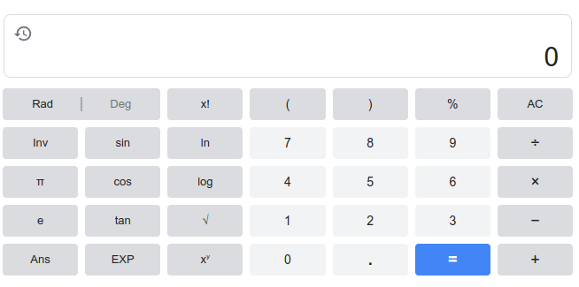
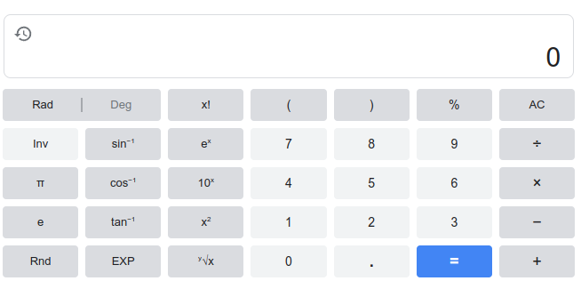
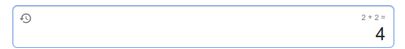
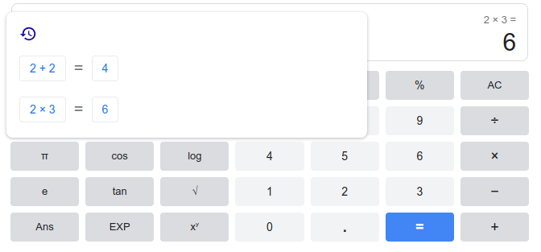

# SRS001 Google.com Calculator
# Software Requirements Specification

## Table of Contents

* 1 [Introduction](#introduction)
* 2 [Opening The Calculator](#opening-the-calculator)
    * 2.1 [RQ.Google.Calculator.Open](#rqgooglecalculatoropen)
* 3 [User Interface](#user-interface)
    * 3.1 [Normal View](#normal-view)
        * 3.1.1 [RQ.Google.Calculator.UI.NormalView](#rqgooglecalculatoruinormalview)
    * 3.2 [Inverse View](#inverse-view)
        * 3.2.1 [RQ.Google.Calculator.UI.InverseView](#rqgooglecalculatoruiinverseview)
    * 3.3 [Keyboard Input](#keyboard-input)
        * 3.3.1 [RQ.Google.Calculator.UI.KeyboardInput](#rqgooglecalculatoruikeyboardinput)
    * 3.4 [Mixed Input](#mixed-input)
        * 3.4.1 [RQ.Google.Calculator.UI.MixedInput](#rqgooglecalculatoruimixedinput)
* 4 [Entering Numbers](#entering-numbers)
    * 4.1 [Digits](#digits)
        * 4.1.1 [RQ.Google.Calculator.EnteringNumbers.Digits](#rqgooglecalculatorenteringnumbersdigits)
    * 4.2 [Negative Numbers](#negative-numbers)
        * 4.2.1 [RQ.Google.Calculator.EnteringNumbers.Negative](#rqgooglecalculatorenteringnumbersnegative)
    * 4.3 [Decimals](#decimals)
        * 4.3.1 [RQ.Google.Calculator.EnteringNumbers.Decimal](#rqgooglecalculatorenteringnumbersdecimal)
        * 4.3.2 [Accuracy](#accuracy)
            * 4.3.2.1 [RQ.Google.Calculator.EnteringNumbers.Decimal.Accuracy](#rqgooglecalculatorenteringnumbersdecimalaccuracy)
* 5 [Infinity](#infinity)
    * 5.1 [RQ.Google.Calculator.EnteringNumbers.Infinity](#rqgooglecalculatorenteringnumbersinfinity)
    * 5.2 [Positive Infinity](#positive-infinity)
        * 5.2.1 [RQ.Google.Calculator.EnteringNumbers.Infinity.Positive](#rqgooglecalculatorenteringnumbersinfinitypositive)
    * 5.3 [Negative Infinity](#negative-infinity)
        * 5.3.1 [RQ.Google.Calculator.EnteringNumbers.Infinity.Negative](#rqgooglecalculatorenteringnumbersinfinitynegative)
* 6 [Limits](#limits)
    * 6.1 [Maximum Positive Number](#maximum-positive-number)
        * 6.1.1 [RQ.Google.Calculator.Limits.MaximumPositiveNumber](#rqgooglecalculatorlimitsmaximumpositivenumber)
    * 6.2 [Maximum Negative Number](#maximum-negative-number)
        * 6.2.1 [RQ.Google.Calculator.Limits.MaximumNegativeNumber](#rqgooglecalculatorlimitsmaximumnegativenumber)
    * 6.3 [Minimum Positive Number](#minimum-positive-number)
        * 6.3.1 [RQ.Google.Calculator.Limits.MinimumPositiveNumber](#rqgooglecalculatorlimitsminimumpositivenumber)
    * 6.4 [Minimum Negative Number](#minimum-negative-number)
        * 6.4.1 [RQ.Google.Calculator.Limits.MinimumNegativeNumber](#rqgooglecalculatorlimitsminimumnegativenumber)
    * 6.5 [Scientific Notation](#scientific-notation)
        * 6.5.1 [RQ.Google.Calculator.EnteringNumbers.ScientificNotation](#rqgooglecalculatorenteringnumbersscientificnotation)
* 7 [Retrieving the Last Answer](#retrieving-the-last-answer)
    * 7.1 [RQ.Google.Calculator.LastAnswer](#rqgooglecalculatorlastanswer)
* 8 [Switching Between Radians and Degrees](#switching-between-radians-and-degrees)
    * 8.1 [RQ.Google.Calculator.SwitchingBetweenRadiansAndDegrees](#rqgooglecalculatorswitchingbetweenradiansanddegrees)
* 9 [Clearing Display](#clearing-display)
    * 9.1 [Clear Entry](#clear-entry)
        * 9.1.1 [RQ.Google.Calculator.ClearingDisplay.ClearEntry](#rqgooglecalculatorclearingdisplayclearentry)
    * 9.2 [Clear All](#clear-all)
        * 9.2.1 [RQ.Google.Calculator.ClearingDisplay.ClearAll](#rqgooglecalculatorclearingdisplayclearall)
* 10 [Calculating the Result](#calculating-the-result)
    * 10.1 [RQ.Google.Calculator.CalculatingResult](#rqgooglecalculatorcalculatingresult)
* 11 [Arithmetic Operations](#arithmetic-operations)
    * 11.1 [Addition](#addition)
        * 11.1.1 [RQ.Google.Calculator.Addition](#rqgooglecalculatoraddition)
    * 11.2 [Subtraction](#subtraction)
        * 11.2.1 [RQ.Google.Calculator.Subtraction](#rqgooglecalculatorsubtraction)
    * 11.3 [Multiplication](#multiplication)
        * 11.3.1 [RQ.Google.Calculator.Multiplication](#rqgooglecalculatormultiplication)
    * 11.4 [Division](#division)
        * 11.4.1 [RQ.Google.Calculator.Division](#rqgooglecalculatordivision)
* 12 [Mathematical Operations](#mathematical-operations)
    * 12.1 [Factorial](#factorial)
        * 12.1.1 [RQ.Google.Calculator.Operations.Factorial](#rqgooglecalculatoroperationsfactorial)
    * 12.2 [Square Root](#square-root)
        * 12.2.1 [RQ.Google.Calculator.Operation.SquareRoot](#rqgooglecalculatoroperationsquareroot)
    * 12.3 [Logarithm](#logarithm)
        * 12.3.1 [RQ.Google.Calculator.Operation.Logarithm](#rqgooglecalculatoroperationlogarithm)
    * 12.4 [Natural Logarithm](#natural-logarithm)
        * 12.4.1 [RQ.Google.Calculator.Operation.NaturalLogarithm](#rqgooglecalculatoroperationnaturallogarithm)
    * 12.5 [Percentage](#percentage)
        * 12.5.1 [RQ.Google.Calculator.Percentage](#rqgooglecalculatorpercentage)
    * 12.6 [X to the power of Y](#x-to-the-power-of-y)
        * 12.6.1 [RQ.Google.Calculator.Operation.XToThePowerOfY](#rqgooglecalculatoroperationxtothepowerofy)
    * 12.7 [Euler's Number To The Power of X](#eulers-number-to-the-power-of-x)
        * 12.7.1 [RQ.Google.Calculator.Operations.EToThePowerOfX](#rqgooglecalculatoroperationsetothepowerofx)
    * 12.8 [10 To The Power of X](#10-to-the-power-of-x)
        * 12.8.1 [RQ.Google.Calculator.Operations.10ToThePowerOfX](#rqgooglecalculatoroperations10tothepowerofx)
    * 12.9 [X Squared](#x-squared)
        * 12.9.1 [RQ.Google.Calculator.Operations.XSquared](#rqgooglecalculatoroperationsxsquared)
    * 12.10 [Nth Root](#nth-root)
        * 12.10.1 [RQ.Google.Calculator.Operations.NthRoot](#rqgooglecalculatoroperationsnthroot)
* 13 [Trigonometric Functions](#trigonometric-functions)
    * 13.1 [Sine](#sine)
        * 13.1.1 [RQ.Google.Calculator.TrigonometricFunctions.Sine](#rqgooglecalculatortrigonometricfunctionssine)
    * 13.2 [Cosine](#cosine)
        * 13.2.1 [RQ.Google.Calculator.TrigonometricFunctions.Cosine](#rqgooglecalculatortrigonometricfunctionscosine)
    * 13.3 [Tangent](#tangent)
        * 13.3.1 [RQ.Google.Calculator.TrigonometricFunctions.Tangent](#rqgooglecalculatortrigonometricfunctionstangent)
    * 13.4 [Arcsine](#arcsine)
        * 13.4.1 [RQ.Google.Calculator.TrigonometricFunctions.Arcsine](#rqgooglecalculatortrigonometricfunctionsarcsine)
    * 13.5 [Arccosine](#arccosine)
        * 13.5.1 [RQ.Google.Calculator.TrigonometricFunctions.Arccosine](#rqgooglecalculatortrigonometricfunctionsarccosine)
    * 13.6 [Arctangent](#arctangent)
        * 13.6.1 [RQ.Google.Calculator.TrigonometricFunctions.Arctangent](#rqgooglecalculatortrigonometricfunctionsarctangent)
* 14 [Mathematical Constants](#mathematical-constants)
    * 14.1 [The pi value - π](#the-pi-value---)
        * 14.1.1 [RQ.Google.Calculator.Constants.Pi](#rqgooglecalculatorconstantspi)
    * 14.2 [Euler's number - e](#eulers-number---e)
        * 14.2.1 [RQ.Google.Calculator.Constants.EulersNumber](#rqgooglecalculatorconstantseulersnumber)
* 15 [Random Number](#random-number)
    * 15.1 [RQ.Google.Calculator.RandomNumber](#rqgooglecalculatorrandomnumber)
* 16 [Expressions](#expressions)
    * 16.1 [Expression Groups](#expression-groups)
        * 16.1.1 [RQ.Google.Calculator.Expressions.Groups](#rqgooglecalculatorexpressionsgroups)
    * 16.2 [Complex Expressions](#complex-expressions)
        * 16.2.1 [RQ.Google.Calculator.Expressions.Complex](#rqgooglecalculatorexpressionscomplex)
    * 16.3 [Order of Operations](#order-of-operations)
        * 16.3.1 [RQ.Google.Calculator.Expressions.OrderOfOperations](#rqgooglecalculatorexpressionsorderofoperations)
* 17 [Answer Prompt](#answer-prompt)
    * 17.1 [RQ.Google.Calculator.AnswerPrompt](#rqgooglecalculatoranswerprompt)
* 18 [Calculation History](#calculation-history)
    * 18.1 [RQ.Google.Calculator.History](#rqgooglecalculatorhistory)
    * 18.2 [History Result](#history-result)
        * 18.2.1 [RQ.Google.Calculator.History.Result](#rqgooglecalculatorhistoryresult)
    * 18.3 [History Expression](#history-expression)
        * 18.3.1 [RQ.Google.Calculator.History.Expression](#rqgooglecalculatorhistoryexpression)
    * 18.4 [History Order](#history-order)
        * 18.4.1 [RQ.Google.Calculator.History.Order](#rqgooglecalculatorhistoryorder)

## Introduction

This software requirements specification covers requirements related to the functionality of the Google.com Calculator.

## Opening The Calculator

### RQ.Google.Calculator.Open
version: 1.0

The calculator SHALL open when the user searches for `calculator` or similar terms in the search box.

## User Interface

### Normal View

#### RQ.Google.Calculator.UI.NormalView
version: 1.0

The calculator SHALL have the following graphical user interface.



### Inverse View

#### RQ.Google.Calculator.UI.InverseView
version: 1.0

The calculator SHALL have the following graphical user interface when `Inv` button is clicked.



### Keyboard Input

#### RQ.Google.Calculator.UI.KeyboardInput
version: 1.0

The calculator SHALL support entering operations and numbers using keyboard.

| Keyboard Input | Description
| --- | --- |
| `0` | digit `0` |
| `1` | digit `1` |
| `2` | digit `2` |
| `3` | digit `3` |
| `4` | digit `4` |
| `5` | digit `5` |
| `6` | digit `6` |
| `7` | digit `7` |
| `8` | digit `8` |
| `9` | digit `9` |
| `+` | addition |
| `-` | subtraction |
| `*` | multiplication |
| `÷` | division |
| `BACKSPACE` | clear (AC/CE) |
| `%` | percentage |
| `(` | left parenthesis |
| `)` | right parenthesis |
| `.` | decimal point |
| `=` | calculate result |
| `ENTER` | calculate result |
| `!` | factorial |
| `s` | sin() |
| `c` | cos() |
| `t` | tan() |
| `S` | arcsin() |
| `C` | arccos() |
| `T` | arctan() |
| `l`, `L` | ln() |
| `g`, `G` | log() |
| `p`, `P` | π constant |
| `e` | Euler's number e |
| `E` | scientific notation `10E3` |
| `q`, `Q` | `√()` square root |
| `a`, `A` | `Ans` answer |
| `^` | <code>x<sup>y</sup></code> x to the power of y |
| `R` | `Rnd` random number |
| `r` | <code><sup>y</sup>√x</code> |

### Mixed Input

#### RQ.Google.Calculator.UI.MixedInput
version: 1.0

The calculator SHALL support entering operations using keyboard and buttons mixed input for the same expression.

## Entering Numbers

### Digits

#### RQ.Google.Calculator.EnteringNumbers.Digits
version: 1.0

The calculator SHALL support entering number digits using `0`-`9` buttons, and the digits SHALL be added to the display.

### Negative Numbers

#### RQ.Google.Calculator.EnteringNumbers.Negative
version: 1.0

The `-` button SHALL allow defining negative numbers.

For example,
```
-2.0
2*-1
(-3
1-.2
```

### Decimals

#### RQ.Google.Calculator.EnteringNumbers.Decimal
version: 1.0

The calculator SHALL support entering decimal numbers using the `.` button to add the decimal point.

The calculator SHALL not allow entering numbers with multiple decimal points.

The `.` SHALL return an `Error`.

The calculator SHALL allow omitting `0` before the `.`. For example,
```
-.2 = 0.2
```

#### Accuracy

##### RQ.Google.Calculator.EnteringNumbers.Decimal.Accuracy
version: 1.0

The calculator SHALL display decimal numbers to the 11th place after the decimal point.

```
0.12345678901
```

## Infinity

### RQ.Google.Calculator.EnteringNumbers.Infinity
version: 1.0

The calculator SHALL support handling positive `Infinity` and negative `-Infinity`.

### Positive Infinity

#### RQ.Google.Calculator.EnteringNumbers.Infinity.Positive
version: 1.0

Any number larger than the maximum positive number SHALL be treated as a positive `Infinity`.

### Negative Infinity

#### RQ.Google.Calculator.EnteringNumbers.Infinity.Negative
version: 1.0

Any number smaller than the maximum negative number SHALL be treated as negative `Infinity`.

## Limits

### Maximum Positive Number

#### RQ.Google.Calculator.Limits.MaximumPositiveNumber
version: 1.0

The calculator SHALL support the maximum positive number `1.7976931348623157e+308` (<code>2<sup>1024</sup>-1</code>).

### Maximum Negative Number

#### RQ.Google.Calculator.Limits.MaximumNegativeNumber
version: 1.0

The calculator SHALL support the maximum negative number of `-1.7976931348623157e+308` (<code>-2<sup>1024</sup>-1</code>).

### Minimum Positive Number

#### RQ.Google.Calculator.Limits.MinimumPositiveNumber
version: 1.0

The calculator SHALL support the minimum positive number of `5E-324`.

Any number that is smaller SHALL be treated as `0`.

```
5E-324/2 = 0
1E-324 = 0
2E-324 = 0
```

### Minimum Negative Number

#### RQ.Google.Calculator.Limits.MinimumNegativeNumber
version: 1.0

The calculator SHALL support the minimum positive number of `-5E-324`.

Any number that is smaller SHALL be treated as `0`.

```
-5E-324/2 = 0
-1E-324 = 0
-2E-324 = 0
```

### Scientific Notation

#### RQ.Google.Calculator.EnteringNumbers.ScientificNotation
version: 1.0

The calculator SHALL support entering numbers in scientific notation using the `EXP` button that SHALL add the `E` to the display.
The `E` SHALL be equivalent to the <code>x 10<sup>x</sup></code> where `x` is the number that follows the `E`.

For example,

```
1E2 = 100
```

## Retrieving the Last Answer

### RQ.Google.Calculator.LastAnswer
version: 1.0

The calculator SHALL support retrieving the last non-`Error` answer using the `ANS` button that SHALL add the `Ans` to the display.

For example,
```
1 x Ans
```

The value of `Ans` by default SHALL be `0`.
```
Ans = 0
```

A multiplication operation SHALL be assumed if there is a current expression. For example,
```
5Ans
```

## Switching Between Radians and Degrees

### RQ.Google.Calculator.SwitchingBetweenRadiansAndDegrees
version: 1.0

The calculator SHALL support specifying angles for the trigonometric functions either in radians or degrees.

The user SHALL be able to switch between them using the `Rad | Deg` button, where the`Rad` SHALL set the radians mode and `Deg` SHALL set the degrees mode.

The default mode SHALL be `Deg`.

## Clearing Display

### Clear Entry

#### RQ.Google.Calculator.ClearingDisplay.ClearEntry
version: 1.0

The calculator SHALL support clearing the last entry using the `CE` button, which SHALL remove the current last character or operator from the display.

If there are no characters or operators left to remove, then `0` SHALL be displayed.

### Clear All

#### RQ.Google.Calculator.ClearingDisplay.ClearAll
version: 1.0

The calculator SHALL support clearing the last result using the `AC` button, which SHALL remove the result of the last expression from the display and display SHALL be set to `0`.

## Calculating the Result

### RQ.Google.Calculator.CalculatingResult
version: 1.0

The calculator SHALL calculate the result of the current expression using the `=` button, which SHALL cause the display to be cleared and show the result of the calculation if and only if the expression is complete.

The evaluation of a complete expression SHALL result in the following:

1. The answer prompt SHALL be set to the expression that was evaluated.

2. The calculation history SHALL be updated to contain the last evaluated expression.

3. The value of `Ans` SHALL be set to the result value.

## Arithmetic Operations

### Addition

#### RQ.Google.Calculator.Addition
version: 1.0

The calculator SHALL support adding integers and decimal numbers using the `+` button, which SHALL add the addition operator to the display.

For example,

```
2 + 2
-9 + 4
2.3 + 1.33
```

The `+` operator SHALL handle `Infinity` as one of its arguments as follows:

| Operation | Result |
| --- | ---|
| `Infinity` + X | `Infinity`  |
| `-Infinity` + X | `-Infinity` |
| `Infinity` + `Infinity` | `Infinity` |
| `Infinity` - `Infinity` | `Error` |

The result of the addition operation when either argument is an `Error` SHALL be `Error`.

| Operation | Result |
| --- | --- |
| 1 + . | `Error` |
| . + . | `Error` |

An incomplete expression SHALL not be evaluated.
```
1 + = 1 +
```

Clicking `+` button SHALL be ignored when the expression does not contain a left argument.
```
(+
```

Incomplete `+` operation SHALL be overwritable by the following operators:

| Operator | Description |
| --- | --- |
| `*` | multiplication |
| `-` | subtraction |
| `/` | division |
| `!` | factorial |
| <code>x<sup>2</sup></code> | X squared |
| <code>x<sup>y</sup></code> | X to the power of Y |
| `y√x` | nth root |

For example,
```
2+- = 2-
```

### Subtraction

#### RQ.Google.Calculator.Subtraction
version: 1.0

The calculator SHALL support subtracting integers and decimal numbers using the `-` button that SHALL add the `-` operation to the display.

For example,
```
2.0 - 2
-9 - 4
```

The `-` operator SHALL handle `Infinity` as one of its arguments as follows:

| Operation | Result |
| --- | ---|
| `Infinity` - X | `Infinity`  |
| X - `Infinity` | `-Infinity` |
| `-Infinity` - X | `-Infinity` |
| `Infinity` - `Infinity` | `Error` |
| `-Infinity` - `Infinity` | `-Infinity` |

The result of the subtraction operation when either argument is an `Error` SHALL be `Error`.
For example,

| Operation | Result |
| --- | --- |
| 1 - . | `Error` |
| . - . | `Error` |

An incomplete expression SHALL not be evaluated.
```
1 -
2 * -
```

An incomplete `-` operation, when `-` is not treated as being used to define a negative number, SHALL be overwritable by the following operators:

| Operator | Description |
| --- | --- |
| `+` | addition |
| `*` | multiplication |
| `/` | division |
| `!` | factorial |
| <code>x<sup>2</sup></code> | X squared |
| <code>x<sup>y</sup></code> | X to the power of Y |
| `y√x` | nth root |

For example,
```
2-+ = 2+
```

### Multiplication

#### RQ.Google.Calculator.Multiplication
version: 1.0

The calculator SHALL support multiplication of integers and decimal numbers using the `×` button, which SHALL add the multiplication operator to the display.

```
-9 × 4
2.3 × 1.33
```

The `×` operator SHALL handle `Infinity` as one of its arguments as follows:

| Operation | Result |
| --- | ---|
| `Infinity` × X | `Infinity`  |
| `-Infinity` × X | `-Infinity` |
| `Infinity` × `Infinity` | `Infinity` |
| `-Infinity` × `Infinity` | `-Infinity` |

The result of the `×` operation when either argument is an `Error` SHALL be `Error`.

| Operation | Result |
| --- | --- |
| 1 × . | `Error` |
| . × . | `Error` |

An incomplete expression SHALL not be evaluated.
```
1 ×
```

Clicking `×` button SHALL be ignored when the expression does not contain a left argument.
```
(×
```

Incomplete `×` operation SHALL be overwritable by the following operators:

| Operator | Description |
| --- | --- |
| `+` | addition |
| `÷` | division |
| `!` | factorial |
| <code>x<sup>2</sup></code> | X squared |
| <code>x<sup>y</sup></code> | X to the power of Y |
| `y√x` | nth root |

For example,
```
2×+ = 2 +
```

### Division

#### RQ.Google.Calculator.Division
version: 1.0

The calculator SHALL support division of integers and decimal numbers using the `÷` button that SHALL add the `÷` operator to the display.

```
2 ÷ 2
2.3 ÷ 1.33
```

Division of positive number by `0` SHALL return `Infinity`.

Division of negative number by `0` SHALL return `-Infinity`.

`0 ÷ 0` SHALL return an `Error`.

The `÷` operator SHALL handle `Infinity` as one of its arguments as follows:

| Operation | Result |
| --- | ---|
| `Infinity` ÷ X | `Infinity`  |
| `-Infinity` ÷ X | `-Infinity` |
| X ÷ `Infinity` | `0` |
| X ÷ `-Infinity` | `0` |
| `Infinity` ÷ `Infinity` | `Error` |
| `-Infinity` ÷ `Infinity` | `Error` |

The result of the `÷` operation when either argument is an `Error` SHALL be `Error`.

| Operation | Result |
| --- | --- |
| 1 ÷ . | `Error` |
| . ÷ . | `Error` |

An incomplete expression SHALL not be evaluated.
```
1 ÷
```

Clicking `÷` button SHALL be ignored when the expression does not contain a left argument.
```
(÷
```

Incomplete `÷` operation SHALL be overwritable by the following operators:

| Operator | Description |
| --- | --- |
| `+` | addition |
| `×` | multiplication |
| `!` | factorial |
| <code>x<sup>2</sup></code> | X squared |
| <code>x<sup>y</sup></code> | X to the power of Y |
| `y√x` | nth root |

For example,
```
2÷+ = 2 +
```

## Mathematical Operations

### Factorial

#### RQ.Google.Calculator.Operations.Factorial
version: 1.0

The calculator SHALL support factorial operation using the `x!` button that SHALL add the `!` symbol to the display.

The factorial operation SHALL be defined as
```
n! = n × (n - 1)!
```

The `0!` SHALL be 1.

The factorial of a negative integer number SHALL be an `Error`.
```
(-4)! = Error
```

The factorial SHALL support positive and negative decimal numbers.
```
3.5! = 11.6317283966
(-0.1)! = 1.06862870212
```

The negative of factorial expression SHALL be the negative of the factorial of the positive number.

```
-4! = -(4!) = -24
```

The maximum factorial that can be calculated SHALL be `170!`.
```
170! = 7.257416e+306
```

The factorial SHALL handle `Infinity` as follows:

| Operation | Result |
| --- | ---|
| `Infinity`! | `Infinity`  |
| `-Infinity`! | `-Infinity` |
| `(-Infinity)`! | `Error` |

The result of the factorial operation when argument is an `Error` SHALL be `Error`.
```
 .! =  Error
```

Clicking `!` button SHALL be ignored when the expression does not contain a left argument.
```
(!
```

The factorial operation SHALL not be overwritable.
```
2!+ = 2! +
```

### Square Root

#### RQ.Google.Calculator.Operation.SquareRoot
version: 1.0

The calculator SHALL support square root operation using the `√` button that SHALL add the `√(`  to the display.
```
√(4)
```

The `√` of a negative number SHALL return an `Error`.
```
√(-1)
```

The `√()` with no arguments SHALL return an `Error`.
```
√()
```

The `√()` SHALL handle `Infinity` as one of its arguments as follows:

| Operation | Result |
| --- | ---|
| `√`(`Infinity`) | `Infinity`  |
| `√`(`-Infinity`) | `Error` |

The result of the `√()` operation when argument is an `Error` SHALL be `Error`.
```
√(.) =  Error
```

The `√(` operation SHALL not be overwritable.
```
√(+
```

### Logarithm

#### RQ.Google.Calculator.Operation.Logarithm
version: 1.0

The calculator SHALL support Logarithm operation using the `log` button that SHALL add the `log(`  to the display.

```
log(4)
```

The `log` of a negative number SHALL return an `Error`.
```
log(-5)
```

The `log` of `0` SHALL return `-Infinity`.
```
log(0)
```

The `log()` with no arguments SHALL return an `Error`.
```
log()
```

The `log()` function SHALL handle `Infinity` as one of its arguments as follows:

| Operation | Result |
| --- | ---|
| `log`(`Infinity`) | `Infinity`  |
| `log`(`-Infinity`) | `Error` |

The result of the `log()` operation when the argument is an `Error` SHALL be `Error`.
```
log(.) =  Error
```

The `log(` operation SHALL not be overwritable.
```
log(+
```

### Natural Logarithm

#### RQ.Google.Calculator.Operation.NaturalLogarithm
version: 1.0

The calculator SHALL support natural logarithm operation using the `ln` button that SHALL add the `ln(`  to the display.

```
ln(6)
```

The `ln` of a negative number SHALL return an `Error`.
```
ln(-6)
```

The `ln` of `0` SHALL return `-Infinity`.
```
ln(0)
```

The `ln()` with no arguments SHALL return an `Error`.
```
ln()
```

The `ln()` function SHALL handle `Infinity` as one of its arguments as follows:

| Operation | Result |
| --- | ---|
| `ln`(`Infinity`) | `Infinity`  |
| `ln`(`-Infinity`) | `Error` |

The result of the `ln()` operation when argument is an `Error` SHALL be `Error`.
```
ln(.) =  Error
```

The `ln(` operation SHALL not be overwritable.
```
ln(+
```

### Percentage

#### RQ.Google.Calculator.Percentage
version: 1.0

The calculator SHALL support specifying percentage using the `%` button, which SHALL add the `%`  operator to the display right after any last number or expression and be equivalent to `/100`.

```
5% + 2
```

If the display is empty when the user enters the `%` operation, then `0%` SHALL be displayed.

The `-%` SHALL return an `Error`.

The `.%` SHALL return an `Error`.

The `Infinity%` SHALL return `Infinity`.

The `-Infinity%` SHALL return `-Infinity`.

The `%` is not valid when entering an argument to any function if it is not preceded by the number, and therefore using `%` button SHALL result in no changes to the current expression.

The `%` SHALL not be overwritable.
```
2%+
```

### X to the power of Y

#### RQ.Google.Calculator.Operation.XToThePowerOfY
version: 1.0

The calculator SHALL support `x` to the power of `y` operation using the <code>x<sup>y</sup></code> button that SHALL add the <code><sup>□</sup></code> to the display.
The next expression entered SHALL specify the exponent `y`.

<code>2<sup>3</sup></code>

If `x` is`-0` and `y` exponent is negative, then the result SHALL be `-Infinity`.

<code>-0<sup>-3</sup></code>

The <code>x<sup>y</sup></code> SHALL handle `Infinity` as the Y exponent as follows:

| Operation | Result |
| --- | ---|
| <code>x<sup>Infinity</sup></code> | `Error`  |
| <code>x<sup>-Infinity</sup></code> | `0` |

The result of the <code>x<sup>y</sup></code> operation when exponent expression is an `Error` SHALL be `Error`.

An incomplete expression SHALL not be evaluated.

<code>2<sup>□</sup></code>

Clicking <code>x<sup>y</sup></code>  button SHALL be ignored when the expression does not contain a left argument.

<code>(x<sup>□</sup></code>

Incomplete <code>x<sup>y</sup></code> operation SHALL be overwritable by the following operators:

| Operator | Description |
| --- | --- |
| `+` | addition |
| `×` | multiplication |
| `÷` | division |
| `!` | factorial |
| <code>x<sup>2</sup></code> | X squared |
| `y√x` | nth root |

<code>2<sup>□</sup>+ = 2 +</code>

### Euler's Number To The Power of X

#### RQ.Google.Calculator.Operations.EToThePowerOfX
version: 1.0

The calculator SHALL support Euler's number, `e`, to the power of `x` operation using the `Inv` <code>e<sup>x</sup></code> button that SHALL add the <code>e<sup>□</sup></code> to the display. The next expression entered SHALL specify the exponent `x`.

<code>e<sup>2</sup></code>

The <code>e<sup>x</sup></code> SHALL handle `Infinity` as the X exponent as follows:

| Operation | Result |
| --- | ---|
| <code>e<sup>Infinity</sup></code> | `Infinity`  |
| <code>e<sup>-Infinity</sup></code> | `0` |

The result of the <code>e<sup>x</sup></code> operation when exponent expression is an `Error` SHALL be `Error`.

An incomplete expression SHALL not be evaluated.

<code>e<sup>□</sup></code>

Incomplete <code>e<sup>x</sup></code> operation SHALL not be overwritable.

The <code>x<sup>2</sup></code> SHALL set the `x` exponent to `2` if `x` was not specified.

### 10 To The Power of X

#### RQ.Google.Calculator.Operations.10ToThePowerOfX
version: 1.0

The calculator SHALL support ten to the power of `x` operation using the `Inv` <code>10<sup>x</sup></code> button that SHALL add the <code>10<sup>□</sup></code> to the display.
The next expression entered SHALL specify the exponent value of `x`.
The multiplication operation SHALL be added if the current expression is non empty before the <code>10<sup>□</sup></code>.

For example,

<code>10<sup>□</sup></code>
<code>0 x 10<sup>□</sup></code>

The <code>10<sup>x</sup></code> SHALL handle `Infinity` as the X exponent as follows:

| Operation | Result |
| --- | ---|
| <code>10<sup>Infinity</sup></code> | `Infinity`  |
| <code>10<sup>-Infinity</sup></code> | `0` |

The result of the <code>10<sup>x</sup></code> operation when the exponent expression is an `Error` SHALL be `Error`.

Incomplete expression SHALL not be evaluated.

<code>10<sup>□</sup></code>

An incomplete <code>10<sup>x</sup></code> operation SHALL not be overwritable.

The <code>x<sup>2</sup></code> SHALL set the `x` exponent to `2` if `x` was not specified.

### X Squared

#### RQ.Google.Calculator.Operations.XSquared
version: 1.0

The calculator SHALL support calculating the square value using the `Inv` <code>x<sup>2</sup></code> button.
If the display is empty, then it SHALL add <code>0<sup>2</sup></code> to the display.

<code>2<sup>2</sup></code>

The <code>x<sup>2</sup></code> SHALL handle `Infinity` as the value to be squared as follows:

| Operation | Result |
| --- | ---|
| <code>Infinity<sup>2</sup></code> | `Infinity`  |
| <code>-Infinity<sup>2</sup></code> | `Infinity` |

The result of the <code>x<sup>2</sup></code> operation when the exponent expression is an `Error` SHALL be `Error`.

An incomplete expression SHALL not be evaluated.

<code>2<sup>□</sup></code>

Incomplete <code>x<sup>2</sup></code> operation SHALL not be overwritable.

Clicking <code>x<sup>2</sup></code>  button SHALL be ignored when the expression does not contain a left argument.

<code>(x<sup>□</sup></code>

### Nth Root

#### RQ.Google.Calculator.Operations.NthRoot
version: 1.0

The calculator SHALL support calculating the value of N<sup>th</sup> root using the `Inv` <code><sup>y</sup>√x</code> button.
If the display is empty then the <code><sup>□</sup>√0</code> to the display.

If `x` is`-0` and `y` is negative, then the result SHALL be `-Infinity`.

For example,
```
-1√-0
```

The <code>x<sup>2</sup></code> SHALL handle `Infinity` as the value to be squared as follows:

| Operation | Result |
| --- | ---|
| <code><sup>Infinity</sup>√x</code> | `1` |
| <code><sup>-Infinity</sup>√x</code> | `1` |
| <code><sup>y</sup>√Infinity</code> | `Infinity` |
| <code><sup>y</sup>√-Infinity</code> | `-Infinity` |
| <code><sup>Infinity</sup>√Infinity</code> | `1` |
| <code><sup>-Infinity</sup>√Infinity</code> | `1` |
| <code><sup>Infinity</sup>√-Infinity</code> | `1` |
| <code><sup>-Infinity</sup>√-Infinity</code> | `1` |

The result of the <code><sup>y</sup>√x</code> operation when either `x` or `y` is an `Error` SHALL be `Error`.

An incomplete expression SHALL not be evaluated.

<code><sup>□</sup>√2</code>

Incomplete <code><sup>y</sup>√x</code> operation SHALL not be overwritable.

Clicking <code><sup>y</sup>√x</code>  button SHALL be ignored when the expression does not contain a left argument.

<code>(<sup>□</sup>√x</code>

## Trigonometric Functions

### Sine

#### RQ.Google.Calculator.TrigonometricFunctions.Sine
version: 1.0

The calculator SHALL support calculating the value of sine the trigonometric function using the `sin` button that SHALL add `sin(` to the display.

The `sin` function SHALL treat the angle as specified in either degrees or radians based on the currently selected `Rad|Deg` mode.

The `sin` function call with an empty value SHALL return an `Error`.

The `sin()` SHALL handle `Infinity` as an argument value as follows:

| Operation | Result |
| --- | ---|
| `sin(Infinity)` | `Error` |
| `sin(-Infinity)` | `Error` |

The result of the `sin` operation when argument is an `Error` SHALL be `Error`.
```
sin(.) = Error
```

### Cosine

#### RQ.Google.Calculator.TrigonometricFunctions.Cosine
version: 1.0

The calculator SHALL support calculating the value of the cosine trigonometric function using the `cos` button that SHALL add `cos(` to the display.

The `cos` function SHALL treat the angle as specified in either degrees or radians based on the currently selected `Rad|Deg` mode.

The `cos` function call with an empty value SHALL return an `Error`.

The `cos()` function SHALL handle `Infinity` as an argument value as follows:

| Operation | Result |
| --- | ---|
| `cos(Infinity)` | `Error` |
| `cos(-Infinity)` | `Error` |

The result of the `cos` operation when argument is an `Error` SHALL be `Error`.
```
cos(.) = Error
```

### Tangent

#### RQ.Google.Calculator.TrigonometricFunctions.Tangent
version: 1.0

The calculator SHALL support calculating the value of the tangent trigonometric function using the `tan` button that SHALL add `tan(` to the display.

The `tan` function SHALL treat the angle as specified in either degrees or radians based on the currently selected `Rad|Deg` mode.

The `tan` function call with an empty value SHALL return an `Error`.

The `tan()` function SHALL handle `Infinity` as an argument value as follows:

| Operation | Result |
| --- | ---|
| `tan(Infinity)` | `Error` |
| `cos(-Infinity)` | `Error` |

The result of the `tan` operation when argument is an `Error` SHALL be `Error`.
```
tan(.) = Error
```

### Arcsine

#### RQ.Google.Calculator.TrigonometricFunctions.Arcsine
version: 1.0

The calculator SHALL support calculating the value of the arcsine trigonometric function using the `Inv` `sin^-1` button that SHALL add `arcsin(` to the display.

The `arcsin` function SHALL treat the angle as specified in either degrees or radians based on the currently selected `Rad|Deg` mode.

The `arcsin` function call SHALL return an `Error` for any argument larger than `1`
or smaller than `-1`.

The `arcsin` function call with an empty value SHALL return an `Error`.

The `arcsin()` function SHALL handle `Infinity` as an argument value as follows:

| Operation | Result |
| --- | ---|
| `arcsin(Infinity)` | `Error` |
| `arcsin(-Infinity)` | `Error` |

The result of the `arcsin` operation when argument is an `Error` SHALL be `Error`.
```
arcsin(.) = Error
```

### Arccosine

#### RQ.Google.Calculator.TrigonometricFunctions.Arccosine
version: 1.0

The calculator SHALL support calculating the value of the arccosine trigonometric function using the `Inv` `cos^-1` button that SHALL add `arccos(` to the display.

The `arccos` function SHALL treat the angle as specified in either degrees or radians based on the currently selected `Rad|Deg` mode.

The `arccos` function call SHALL return an `Error` for any argument larger than `1`
or smaller than `-1`.

The `arccos` function call with an empty value SHALL return an `Error`.

The `arcsin()` SHALL handle `Infinity` as an argument value as follows:

| Operation | Result |
| --- | ---|
| `arccos(Infinity)` | `Error` |
| `arccos(-Infinity)` | `Error` |

The result of the `arccos` operation when argument is an `Error` SHALL be `Error`.
```
arccos(.) = Error
```

### Arctangent

#### RQ.Google.Calculator.TrigonometricFunctions.Arctangent
version: 1.0

The calculator SHALL support calculating the value of the arctangent trigonometric function using the `Inv` `tan^-1` button that SHALL add `arctan(` to the display.

The `arctan` function SHALL treat the angle as specified in either degrees or radians based on the currently selected `Rad|Deg` mode.

The `arctan` function call with an empty value SHALL return an `Error`.

The `arctan()` function SHALL handle `Infinity` as an argument value as follows:

| Operation | Result |
| --- | ---|
| `arctan(Infinity)` | `90` |
| `arcsin(-Infinity)` | `-90` |

The result of the `arctan` operation when argument is an `Error` SHALL be `Error`.
```
arctan(.) = Error
```

## Mathematical Constants

### The pi value - π

#### RQ.Google.Calculator.Constants.Pi
version: 1.0

The calculator SHALL support entering the constant value of pi using the `π` button, which SHALL add `π` symbol to the display and be equivalent to `3.14159265359`.

### Euler's number - e

#### RQ.Google.Calculator.Constants.EulersNumber
version: 1.0

The calculator SHALL support entering a constant Euler's number using the `e` button, which SHALL add `e` symbol to the display that SHALL be equivalent to `2.71828182846`.

## Random Number

### RQ.Google.Calculator.RandomNumber
version: 1.0

The calculator SHALL support generating a random number from `0` to `1` using the `Inv` `Rnd` button that SHALL add the generated number to the display.

If the current expression ends with a number, then the generated number is preceded by the multiplication `x` operation.

## Expressions

### Expression Groups

#### RQ.Google.Calculator.Expressions.Groups
version: 1.0

The calculator SHALL support defining expression groups using left `(` and right `)` parenthesis buttons, and the corresponding character SHALL be displayed.

An expression within the group SHALL be evaluated first, and nested groups SHALL be supported.

Right `)` parenthesis SHALL only be allowed if there is a matching left `)` parenthesis open and the expression is not empty.

Any number of missing right `)` parenthesis to close currently open groups SHALL be auto completed automatically on evaluation and SHALL not generate an `Error`.

### Complex Expressions

#### RQ.Google.Calculator.Expressions.Complex
version: 1.0

The calculator SHALL support the evaluation of complex expressions that include multiple expression groups.

For example,
```
(2 + 2) / ((1+2) * (sin(20)))
```

### Order of Operations

#### RQ.Google.Calculator.Expressions.OrderOfOperations
version: 1.0

The calculator SHALL execute the expression respecting the standard order of operations:

* parentheses first
* exponents (powers, square roots, etc.)
* multiplication and division (left-to-right)
* addition and subtraction (left-to-right)

## Answer Prompt

### RQ.Google.Calculator.AnswerPrompt
version: 1.0

The calculator SHALL support showing in the top right corner an answer prompt that display the expression that produced the last result.

The last calculation expression SHALL be visually truncated if it does not fit the allocated display's width.

For example,
```
2 + 2
```



## Calculation History

### RQ.Google.Calculator.History
version: 1.0

The calculator SHALL provide calculation history when the user clicks on the `🕑` button on the left top corner.



### History Result

#### RQ.Google.Calculator.History.Result
version: 1.0

The calculator history SHALL support clicking on the result of the previous calculation, and that result SHALL be added to the display.

The `Error` result SHALL not be clickable.

### History Expression

#### RQ.Google.Calculator.History.Expression
version: 1.0

The calculator history SHALL support clicking on the calculation expression of the previous calculation, and that expression SHALL replace any content currently present on the display.

The calculator history SHALL truncate very long expressions using the `...`.

### History Order

#### RQ.Google.Calculator.History.Order
version: 1.0

The calculator's history SHALL add the last calculation to the bottom of the list.

The calculator history SHALL open with the list scrolled to the bottom showing the most recent calculation.
